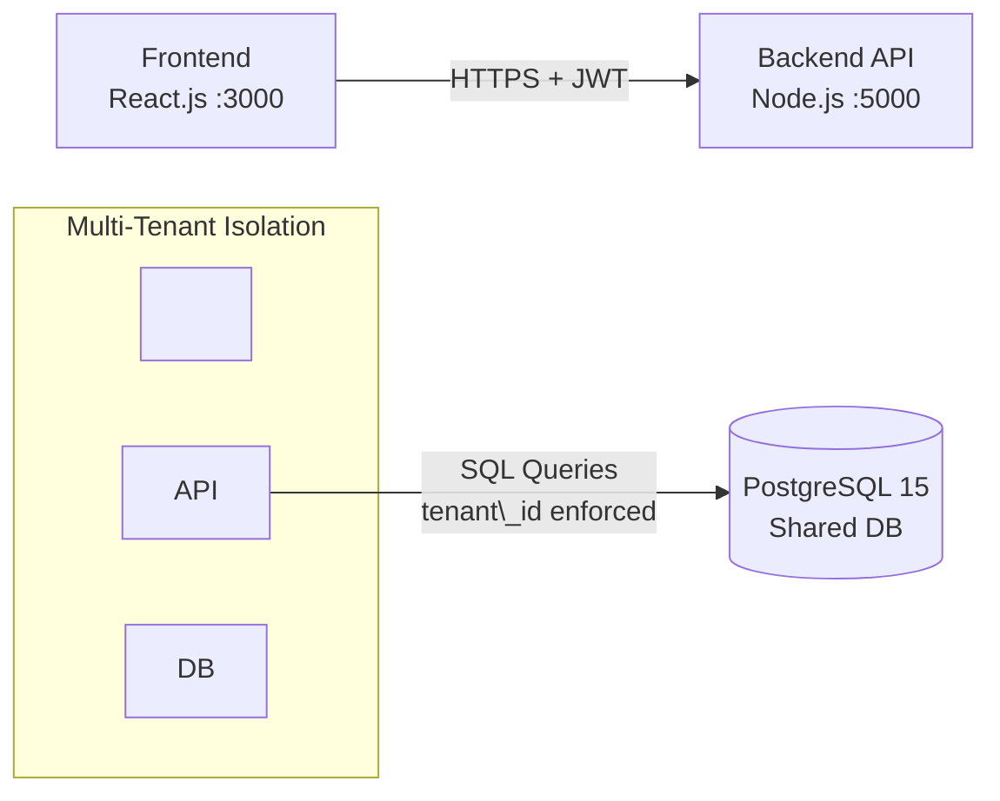

\# System Architecture Document


\*\*Project Name:\*\* Multi-Tenant SaaS Project Management System

\*\*Date:\*\* October 26, 2025

\*\*Version:\*\* 1.0

\*\*Author:\*\* AWS Student / Lead Developer


---


\## 1. System Architecture Design


The system follows a containerized 3-tier web architecture designed for modularity and isolation. The entire stack is orchestrated via Docker Compose, ensuring environment consistency between development and production.


\### High-Level Architecture Diagram

!\[System Architecture Diagram](docs/images/system-architecture.png)


> \*Note: If the image above does not render, please refer to the Mermaid definition below which describes the flow.\*


```mermaid

graph LR

&nbsp;   User\[Client Browser] -->|HTTPS / Port 3000| Frontend\[Frontend Container\\n(React + Vite)]

&nbsp;   Frontend -->|REST API / JSON| Backend\[Backend Container\\n(Node.js + Express)]

&nbsp;   Backend -->|SQL Query + tenant\_id| DB\[(Database Container\\nPostgreSQL)]

&nbsp;   

&nbsp;   subgraph Docker Network

&nbsp;       Frontend

&nbsp;       Backend

&nbsp;       DB

&nbsp;   end

&nbsp;   

&nbsp;   subgraph Security Layer

&nbsp;       Backend -- Authenticates --> JWT\[JWT Service]

&nbsp;       Backend -- Enforces --> RBAC\[Role Middleware]

&nbsp;   end
```


\## System Architecture \& Components


The system follows a \*\*multi-tenant, containerized architecture\*\* with clear separation between frontend, backend, and database layers.


---


\## Components Description


\### Client Layer (Frontend)


\- \*\*Technology:\*\* React.js (Vite Build Tool)

\- \*\*Container Port:\*\* `3000 (External) → 3000 (Internal)`

\- \*\*Responsibilities:\*\*

&nbsp; - Renders the user interface

&nbsp; - Handles user interactions

&nbsp; - Manages authentication state (JWT storage)

&nbsp; - Communicates with the Backend API

\- \*\*Multi-Tenancy:\*\*

&nbsp; - Tenant context identified via:

&nbsp;   - Subdomain (e.g., `tenant1.app.com`), or

&nbsp;   - Login form input


---


\### Application Layer (Backend API)


\- \*\*Technology:\*\* Node.js, Express.js

\- \*\*Container Port:\*\* `5000 (External) → 5000 (Internal)`

\- \*\*Responsibilities:\*\*

&nbsp; - Business logic execution

&nbsp; - Authentication (JWT)

&nbsp; - Authorization (RBAC)

&nbsp; - Tenant isolation enforcement

\- \*\*Isolation Mechanism:\*\*

&nbsp; - Middleware extracts `tenant\_id` from JWT

&nbsp; - Injects `tenant\_id` into database query context

&nbsp; - Ensures strict tenant-level data isolation


---


\### Data Layer (Database)


\- \*\*Technology:\*\* PostgreSQL 15

\- \*\*Container Port:\*\* `5432 (External) → 5432 (Internal)`

\- \*\*Responsibilities:\*\*

&nbsp; - Persistent relational data storage

\- \*\*Isolation Strategy:\*\*

&nbsp; - \*\*Shared Database, Shared Schema\*\*

&nbsp; - Logical isolation via `tenant\_id` discriminator column

&nbsp; - `tenant\_id` exists in all tenant-owned tables


---


\## High-Level System Architecture (Mermaid)





\## Database Schema Design (ERD)


The database schema is normalized to \*\*Third Normal Form (3NF)\*\* to eliminate redundancy and ensure data integrity.


The `tenant\_id` column acts as the \*\*logical partition key\*\* for multi-tenancy, enabling secure data isolation within a shared database and shared schema model.


```mermaid

erDiagram

&nbsp;   TENANTS ||--o{ USERS : owns

&nbsp;   TENANTS ||--o{ PROJECTS : owns

&nbsp;   TENANTS ||--o{ TASKS : owns

&nbsp;   TENANTS ||--o{ AUDIT\_LOGS : records


&nbsp;   USERS ||--o{ PROJECTS : creates

&nbsp;   PROJECTS ||--o{ TASKS : contains

&nbsp;   USERS ||--o{ TASKS : assigned\_to


&nbsp;   TENANTS {

&nbsp;       uuid id PK

&nbsp;       string name

&nbsp;       string subdomain UK

&nbsp;       string status

&nbsp;       string subscription\_plan

&nbsp;       int max\_users

&nbsp;       int max\_projects

&nbsp;   }


&nbsp;   USERS {

&nbsp;       uuid id PK

&nbsp;       uuid tenant\_id FK

&nbsp;       string email

&nbsp;       string password\_hash

&nbsp;       string full\_name

&nbsp;       string role

&nbsp;   }


&nbsp;   PROJECTS {

&nbsp;       uuid id PK

&nbsp;       uuid tenant\_id FK

&nbsp;       uuid created\_by FK

&nbsp;       string name

&nbsp;       string description

&nbsp;       string status

&nbsp;   }


&nbsp;   TASKS {

&nbsp;       uuid id PK

&nbsp;       uuid tenant\_id FK

&nbsp;       uuid project\_id FK

&nbsp;       uuid assigned\_to FK

&nbsp;       string title

&nbsp;       string priority

&nbsp;       string status

&nbsp;       date due\_date

&nbsp;   }


&nbsp;   AUDIT\_LOGS {

&nbsp;       uuid id PK

&nbsp;       uuid tenant\_id FK

&nbsp;       string action

&nbsp;       string entity\_type

&nbsp;       uuid entity\_id

&nbsp;       string ip\_address

&nbsp;   }

```


\## Schema Details


\### `tenants` (Root Entity)

\- \*\*Primary Key:\*\* `id (UUID)`

\- \*\*Data:\*\*

&nbsp; - `name`

&nbsp; - `subdomain` (Unique)

&nbsp; - `status`

&nbsp; - `subscription\_plan`

\- \*\*Constraints:\*\*

&nbsp; - `max\_users`

&nbsp; - `max\_projects`

\- \*\*Isolation:\*\*

&nbsp; - Root table (no `tenant\_id` column)


---


\### `users`

\- \*\*Primary Key:\*\* `id (UUID)`

\- \*\*Foreign Key:\*\*

&nbsp; - `tenant\_id → tenants.id` (`ON DELETE CASCADE`) \*\*\[ISOLATION KEY]\*\*

\- \*\*Data:\*\*

&nbsp; - `email`

&nbsp; - `password\_hash`

&nbsp; - `full\_name`

&nbsp; - `role`

\- \*\*Constraint:\*\*

&nbsp; - `UNIQUE (tenant\_id, email)`  

&nbsp;   (Emails are unique per tenant)


---


\### `projects`

\- \*\*Primary Key:\*\* `id (UUID)`

\- \*\*Foreign Keys:\*\*

&nbsp; - `tenant\_id → tenants.id` (`ON DELETE CASCADE`) \*\*\[ISOLATION KEY]\*\*

&nbsp; - `created\_by → users.id`

\- \*\*Data:\*\*

&nbsp; - `name`

&nbsp; - `description`

&nbsp; - `status`

\- \*\*Index:\*\*

```sql

CREATE INDEX idx\_projects\_tenant ON projects(tenant\_id);

```


\### `tasks`

\- \*\*Primary Key:\*\* `id (UUID)`

\- \*\*Foreign Keys:\*\*

&nbsp; - `project\_id → projects.id` (`ON DELETE CASCADE`)

&nbsp; - `tenant\_id → tenants.id` \*\*\[ISOLATION KEY]\*\*

&nbsp; - `assigned\_to → users.id` (Nullable)

\- \*\*Data:\*\*

&nbsp; - `title`

&nbsp; - `priority`

&nbsp; - `status`

&nbsp; - `due\_date`

\- \*\*Index:\*\*

```sql

CREATE INDEX idx\_tasks\_tenant ON tasks(tenant\_id);


\### `audit\_logs`

\- \*\*Primary Key:\*\* `id (UUID)`

\- \*\*Foreign Key:\*\*

&nbsp; - `tenant\_id → tenants.id` \*\*\[ISOLATION KEY]\*\*

\- \*\*Data:\*\*

&nbsp; - `action`

&nbsp; - `entity\_type`

&nbsp; - `entity\_id`

&nbsp; - `ip\_address`


\## API Architecture


The application exposes \*\*19 RESTful endpoints\*\* following REST principles.


\### Standard API Response Format


All API responses follow a consistent structure:


```json

{

&nbsp; "success": true,

&nbsp; "message": "Operation completed successfully",

&nbsp; "data": {}

}

```


\### Module A: Authentication


| Method | Endpoint | Description | Authentication Required | Role |

|-------:|----------|-------------|--------------------------|------|

| POST | `/api/auth/register-tenant` | Register new organization and tenant admin | No | Public |

| POST | `/api/auth/login` | Login and receive JWT | No | Public |

| GET | `/api/auth/me` | Get current user context | Yes | Any |

| POST | `/api/auth/logout` | Invalidate user session | Yes | Any |


\### Module B: Tenant Management


| Method | Endpoint | Description | Authentication Required | Role |

|-------:|----------|-------------|--------------------------|------|

| GET | `/api/tenants` | List all tenants (System Admin) | Yes | `super\_admin` |

| GET | `/api/tenants/:tenantId` | Get specific tenant details | Yes | `super\_admin` or `owner` |

| PUT | `/api/tenants/:tenantId` | Update tenant settings or subscription | Yes | `super\_admin` or `tenant\_admin` |


\### Module C: User Management


| Method | Endpoint | Description | Authentication Required | Role |

|-------:|----------|-------------|--------------------------|------|

| POST | `/api/tenants/:tenantId/users` | Create a new user within a tenant | Yes | `tenant\_admin` |

| GET | `/api/tenants/:tenantId/users` | List all users in a tenant | Yes | Any tenant member |

| PUT | `/api/users/:userId` | Update user profile or role | Yes | `tenant\_admin` or Self |

| DELETE | `/api/users/:userId` | Remove user from tenant | Yes | `tenant\_admin` |


\### Module D: Project Management


| Method | Endpoint | Description | Authentication Required | Role |

|-------:|----------|-------------|--------------------------|------|

| POST | `/api/projects` | Create a new project | Yes | Any tenant member |

| GET | `/api/projects` | List projects (scoped to tenant) | Yes | Any tenant member |

| PUT | `/api/projects/:projectId` | Update project details | Yes | Creator or Admin |

| DELETE | `/api/projects/:projectId` | Delete a project | Yes | Creator or Admin |


\### Module E: Task Management


| Method | Endpoint | Description | Authentication Required | Role |

|-------:|----------|-------------|--------------------------|------|

| POST | `/api/projects/:projectId/tasks` | Create a task within a project | Yes | Any tenant member |

| GET | `/api/projects/:projectId/tasks` | List all tasks in a project | Yes | Any tenant member |

| PATCH | `/api/tasks/:taskId/status` | Quickly update task status | Yes | Any tenant member |

| PUT | `/api/tasks/:taskId` | Perform a full task update | Yes | Any tenant member |


